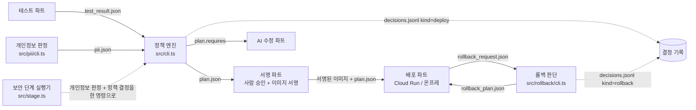

# 파일 계약 (contracts)

> 이 폴더는 정책 엔진(policy) 기준으로 자동 생성한 **데이터 양식 초안**입니다. 팀 공통 양식은 루트 `contracts/`에서
> 관리하며, 원본 형식과 옮기는 방법은 팀 회의에서 정합니다. 그 전까지 다른 파트는 참고용으로만 봐주세요.

다른 파트와 주고받는 JSON 파일의 형식. **`npm run contracts` 가 `src/schema.ts` 에서 자동 생성한다. 손으로 고치지 말 것.**

각 파일의 JSON Schema(draft 2020-12)가 이 폴더에 함께 있다. 어떤 언어에서든 그 스키마로 검증할 수 있고, 이 저장소에서는 다음으로 검증한다.

```bash
npx tsx src/validate.ts --type test_result --file some.json
```

`--type` 은 `test_result` | `pii` | `plan` | `rollback_request` | `rollback_plan` | `decision_log`(jsonl, 줄마다 검증) | `policy`(yaml).

## 흐름



보안 단계 실행기(`npx tsx src/stage.ts --src <앱> --test test_result.json --policy policy.yaml --out-dir <폴더>`)는 개인정보 판정과 정책 결정을 한 번에 돌려 `pii.json` 과 `plan.json` 을 만들고, 결정을 종료 코드로 알린다 (allow 0, needs_approval 2, block 3, 실행 오류 1). 파일 형식은 위와 같다.

| 파일 | 만드는 쪽 | 쓰는 쪽 |
|---|---|---|
| [`test_result.json`](#test_resultjson--testresult) | 테스트 파트 | 정책 엔진 (`src/cli.ts`) |
| [`pii.json`](#piijson--piireport) | 개인정보 판정 모듈 (`src/pii/cli.ts`, 이 저장소) | 정책 엔진 (`src/cli.ts`) |
| [`plan.json`](#planjson--plan) | 정책 엔진 (`src/cli.ts`, 이 저장소) | 서명 파트 (승인·서명), 배포 파트 (targets, failover_allowed), AI 수정 파트 (requires) |
| [`rollback_request.json`](#rollback_requestjson--rollbackrequest) | 배포 파트 | 롤백 판단 모듈 (`src/rollback/cli.ts`) |
| [`rollback_plan.json`](#rollback_planjson--rollbackplan) | 롤백 판단 모듈 (`src/rollback/cli.ts`, 이 저장소) | 배포 파트 (실제 롤백 실행) |
| [`decisions.jsonl`](#decisionsjsonl--decisionlog) | 정책 엔진과 롤백 판단 모듈 (이 저장소) | 발표·감사·디버깅 (사람), 필요하면 대시보드 |

입력 파일(test_result, pii, rollback_request)은 모르는 필드가 있어도 받는다(무시). 출력 파일(plan, rollback_plan, decisions.jsonl)은 적힌 필드만 있고, 추가 필드가 있으면 zod 와 JSON Schema 모두 거부한다.

## 정책이 읽는 필드

`policy.yaml` 의 규칙이 실제로 참조하는 경로. 여기 나온 필드를 바꾸면 정책도 같이 봐야 한다. `npm run contracts` 가 규칙에서 자동으로 모은다.

`some` 조건 안의 경로는 `배열[].필드` 로 적었다. 조건에서 읽는 필드는 값의 형식이 정확해야 하고(예: `test.facts.db` 는 소문자 enum), reason 에서만 읽는 필드는 표시용이다.

**배포 규칙** (루트 `{ test: test_result.json, pii: pii.json }`)

| 경로 | 읽는 규칙 | 용도 |
|---|---|---|
| `pii.pii` | R3, R4 | 조건 |
| `pii.pii[].column` | R3, R4 | reason |
| `pii.pii[].confident` | R3 | 조건 |
| `pii.pii[].evidence` | R3, R4 | reason |
| `pii.pii[].kind` | R3, R4 | reason |
| `pii.pii[].table` | R3 | reason |
| `pii.run_id` | R2 | 조건, reason |
| `test.facts.db` | R5 | 조건, reason |
| `test.facts.migration.destructive` | R7 | 조건 |
| `test.facts.migration.findings` | R7 | 조건 |
| `test.facts.migration.findings[].evidence` | R7 | reason |
| `test.facts.migration.findings[].kind` | R7 | reason |
| `test.facts.migration.findings[].statement` | R7 | reason |
| `test.facts.writes_local_file` | R6 | 조건 |
| `test.facts.writes_local_file[]` | R6 | 조건, reason |
| `test.match.matched` | R1 | reason |
| `test.match.total` | R1 | reason |
| `test.passed` | R1 | 조건 |
| `test.run_id` | R2 | 조건, reason |

**롤백 규칙** (루트 `{ request: rollback_request.json }`)

| 경로 | 읽는 규칙 | 용도 |
|---|---|---|
| `request.stage` | RB1 | 조건 |
| `request.state.db_migration_backward_compatible` | RB2 | 조건 |
| `request.state.pii_written_onprem` | RB3 | 조건 |
| `request.state.writes_since_cutover` | RB4 | 조건 |

규칙이 `test.facts` 의 정의되지 않은 키를 읽으면 정책을 불러올 때 경고가 난다. 새 키가 필요하면 `src/schema.ts` 의 `FactsSchema` 에 먼저 추가한다.

## 팀과 합의가 필요한 점

1. **run_id 와 digest 는 끝까지 그대로 전달한다.** `source_revision`(커밋 SHA, 선택)도 있으면 그대로 전달한다 (아래 "최근 추가된 필드" 참고). 테스트 파트가 정한 `run_id` 와 이미지 `digest` 가 test_result → pii → plan → 서명 → 배포 → rollback_request 까지 바뀌지 않아야 한다. 정책 엔진은 test_result 와 pii 의 `run_id` 가 다르면 차단한다(R2). `digest` 는 `sha256:` + 소문자 hex 64자만 받고(결정 기록의 digest 와 plan_hash 도 같은 형식), `run_id` 는 영문·숫자·`._-` 만 1~64자다. rollback_request 의 `candidate.targets` 와 `stable.targets` 는 `known_targets` 안에 있어야 한다.
2. **비밀값은 어떤 파일에도 넣지 않는다.** API 키, 토큰, 접속 문자열을 `facts`, `failures`, `evidence` 등에 넣지 말 것. 개인정보 판정 모듈은 근거 조각의 비밀처럼 보이는 값을 `[REDACTED]` 로 가리지만, 다른 파트의 파일은 각자 책임진다.
3. **선택 필드는 "없을 수 있다" 는 뜻이지 "null 을 넣어도 된다" 는 뜻이 아니다.** 예: `plan.requires` 는 없거나 객체 배열이다. `pii[].source` 도 마찬가지.
4. **최근 추가된 필드**
   - `test_result.source_revision` / `rollback_request.source_revision` (선택, 소문자 hex 7~40자): 테스트한 소스의 **커밋 SHA**. 백엔드가 webhook 의 커밋 SHA 를 고정해서 넘긴다. 아직 선택이며 `"unknown"` 은 없는 것으로 취급한다. 값이 있으면 `plan.source_revision` / `rollback_plan.source_revision` 과 결정 기록(`decisions.jsonl`)에 그대로 실리고 `plan_hash` 에도 반영된다. 없으면 출력에 필드 자체가 없고 기존 `plan_hash` 는 바뀌지 않는다. 보안 단계 실행기의 `--source-revision` 옵션이 test_result 의 값보다 우선하며, 둘 다 있는데 다르면 실행 오류(종료 코드 1)다. 결정 설명의 맨 아래 줄에 커밋 앞 7자리가 표시된다.
   - `plan.requires` / `rollback_plan.requires` (선택, `[{ id, hint?, rule_id, allowed_targets }]`): 해결 조건. 걸린 규칙들이 "이 규칙을 피하려면 무엇이 필요한가" 를 적은 것을 id 로 합치고 id 순으로 정렬한 것 (예: `[{ "id": "managed_db", "hint": "SQLite를 PostgreSQL로 전환", "rule_id": "R5", "allowed_targets": ["onprem", "cloud_run"] }]`). AI 수정 파트가 `id` 로 분기하고 `hint` 를 사람에게 보여준다. `decision` 이 `block` / `needs_approval` / `manual_recovery` 면 항상 1개 이상 있다. 없으면 필드 자체가 없다. 엔진이 스스로 차단할 때(허용 대상 교집합 공백)는 `resolve_target_conflict` / `manual_target_recovery` 가 들어간다.
   - `rules[].result` 는 `matched` / `not_matched` / `matched_after_block` 세 가지다. `block`(롤백은 `manual_recovery`)이 나와도 엔진은 끝까지 평가해 targets 좁히기와 해결 조건을 모두 모으므로, 차단 뒤에 걸린 규칙은 `matched_after_block` 으로 온다. 이 규칙들은 decision 을 바꾸지 않았다. 유일한 예외는 `halt: true` 인 규칙(현재 R2 입력 불일치)과 롤백의 `keep_stable`: 그 자리에서 멈추고 뒤 규칙은 목록에 없다.
   - `rules[].reason_i18n` / `requires[].hint_i18n` (선택, `{ ja }`): 규정집(policy.yaml)의 reason 과 hint 를 `{ ko, ja }` 로 적으면 결정서의 `reason` / `hint` 는 ko 문자열 그대로이고, 일본어 문구가 이 필드에 함께 실린다. 정책에 ja 가 없으면 필드 자체가 없다. 결정 설명(`src/explain.ts --lang ja`)은 이 필드를 쓰고, 없으면 ko 로 대체한다. 결정 로직에는 영향이 없다.
   - **`allowed_targets` 는 이 해결 조건과 연결된 정책 위반이 해소됐다고 가정했을 때, 나머지 정책 제약상 가능한 배포 위치다.** 한 규칙이 해결 조건을 여러 개 요구하면 모두 충족해야 하고, 수정 후에는 새 버전으로 전체 정책을 다시 평가한다 (이 값은 예고이지 보증이 아니다). 계산은 그 조건을 요구한 규칙들을 뺀 나머지 걸린 규칙만으로 `default.targets`(롤백은 `stable.targets`)에서 좁힌 결과이며, 해결 조건마다 다를 수 있다. 예: SQLite 만 걸린 앱의 `managed_db` 는 `["onprem", "cloud_run"]`(고치면 클라우드도 가능), SQLite + 개인정보 앱의 `managed_db` 는 `["onprem"]`(개인정보 규칙이 남으므로 관리형 DB 도 온프레여야 하며 Cloud SQL 로 옮기면 안 된다). 나머지 규칙끼리 충돌하면 빈 배열이다. decision 에는 영향이 없다.
   - `decisions.jsonl` 의 `kind` (`deploy` | `rollback`): 같은 파일에 두 종류의 결정이 섞이므로 반드시 `kind` 로 구분해서 읽을 것. 두 종류는 필드 구성이 다르다.
   - `rollback_plan.serve_digest` (string | null): 결정 후 트래픽을 받아야 할 버전. `keep_stable`/`rollback` 이면 `stable.digest`, `manual_recovery` 면 null. 배포 파트는 `decision` 이 아니라 이 값으로 라우팅 대상을 정하면 된다.
   - `rollback_request.candidate` / `stable`: 예전 이름 `current` / `previous` 는 받지 않는다. candidate = 이번 배포 후보(문제가 난 버전), stable = 이번 배포 전 정상 버전.
   - `failover_allowed` (plan, rollback_plan): `onprem` 과 `cloud_run` 이 모두 targets 에 있을 때만 true 가 될 수 있다. 배포 파트는 이 값이 false 면 온프레 장애 시 Cloud Run 으로 넘기지 않는다.
5. **targets 의 값은 policy.yaml 의 `known_targets`(현재 `onprem`, `cloud_run`) 안에서만 나온다.** 배포 파트가 새 대상을 지원하면 `known_targets` 에 먼저 추가해야 한다.
   - **`test_result.facts` 는 정책이 읽는 키만 타입이 정해져 있다** (`db`: `sqlite` | `postgres` | `mysql` | `none` 소문자, `writes_local_file`: string[], `migration`: 파괴적 마이그레이션 판정 `{ destructive, backward_compatible, findings }`). 대문자 `"SQLite"` 나 숫자는 형식 오류다. 그 밖의 키(예: `framework`)는 자유롭게 넣을 수 있고 그대로 보존된다. 정책이 새 키를 읽어야 하면 스키마에 먼저 추가한다 ("정책이 읽는 필드" 표 참고).
   - **`facts.migration` 은 테스트 파트가 넣어도 되고 비워 둬도 된다.** 비워 두면 보안 단계 실행기(`src/stage.ts`)가 앱 폴더의 `migrations/**/*.sql` 과 `prisma/migrations/*/migration.sql` 을 읽어 판정해 채운다 (`--since <이름>` 으로 이미 적용된 마이그레이션은 건너뛴다). 넣어 주면 그 값을 존중한다. 단독 실행은 `npx tsx src/migration/cli.ts --src <앱> --out migration.json`. `destructive: true` 면 R7 이 차단하고 해결 조건 `two_phase_migration` 을 낸다.
6. **decisions.jsonl 은 추가만 한다.** 기존 줄을 고치거나 지우지 않는다. 시간(`time`)은 CLI 가 붙이므로 같은 입력으로 다시 돌리면 `plan_hash` 는 같고 `time` 만 다르다.
7. **파일 형식을 바꾸고 싶으면 `src/schema.ts` 를 고치고 `npm run contracts` 로 이 문서를 다시 만든다.** 손으로 고친 문서는 다음 생성 때 사라진다.

## test_result.json — TestResult

- **JSON Schema**: [`TestResult.schema.json`](./TestResult.schema.json)
- **만드는 쪽**: 테스트 파트
- **쓰는 쪽**: 정책 엔진 (`src/cli.ts`)
- **내용**: 로컬에서 기록한 요청/응답을 클라우드 조건에서 재생한 판정 결과와, 테스트 중 관찰한 사실(facts)
- **검증**: `npx tsx src/validate.ts --type test_result --file <파일>`

### 필드

| 필드 | 타입 | 필수 | 설명 |
|---|---|---|---|
| `run_id` | string | 필수 | 파이프라인 실행 id. 영문·숫자·._- 만, 1~64자. 모든 파일이 같은 값을 가져야 한다 |
| `app` | string | 필수 | 앱 이름 |
| `digest` | string | 필수 | 컨테이너 이미지 지문. 'sha256:' + 소문자 hex 64자. 테스트한 이미지 = 결정한 이미지 = 서명·배포할 이미지 |
| `source_revision` | union | 선택 | 테스트한 소스의 커밋 SHA (선택). 소문자 hex 7~40자. "unknown" 은 없는 것으로 취급한다 |
| `passed` | boolean | 필수 | 재생 테스트 통과 여부. false 면 정책 엔진이 차단한다 |
| `match` | object | 필수 | 재생 결과 요약 |
| `match.total` | integer | 필수 | 재생한 요청 수 |
| `match.matched` | integer | 필수 | 응답이 일치한 요청 수 |
| `failures` | any[] | 선택 (기본값 `[]`) | 실패한 요청 목록. 형식은 테스트 파트가 정한다 (정책 엔진은 내용을 보지 않음) |
| `facts` | object | 선택 (기본값 `{}`) | 테스트 중 관찰한 사실. 정의된 키(db, writes_local_file, migration)는 타입이 고정되고, 그 밖의 키는 자유 |
| `facts.db` | "sqlite" \| "postgres" \| "mysql" \| "none" | 선택 | 앱이 쓰는 DB. 소문자만. R5 가 읽는다 |
| `facts.writes_local_file` | string[] | 선택 | 앱이 쓰는 로컬 파일 경로 목록. R6 가 읽는다 |
| `facts.migration` | object | 선택 | 파괴적 DB 마이그레이션 판정. 실행기(src/stage.ts)가 facts.migration 이 없으면 채운다 |
| `facts.migration.destructive` | boolean | 필수 | 파괴적 변경이 하나라도 있는지. R7 이 읽는다 |
| `facts.migration.backward_compatible` | boolean | 필수 | 이전 버전과 호환되는지 = 파괴적 변경이 없을 때 true |
| `facts.migration.findings` | object[] | 필수 | 파괴적 변경 목록. 없으면 빈 배열 |
| `facts.migration.findings[].kind` | "drop_table" \| "drop_column" \| "rename_table" \| "rename_column" \| "alter_column_type" \| "add_not_null_without_default" \| "set_not_null" \| "truncate" | 필수 | 파괴적 변경의 종류 |
| `facts.migration.findings[].statement` | string | 필수 | 해당 SQL 문장 (한 줄로 줄임) |
| `facts.migration.findings[].evidence` | string | 필수 | 위치 '파일:줄' |
| `facts.*` | any | 선택 | 그 밖의 키는 자유. 그대로 보존되지만 정책은 읽지 않는다 |

### 예시 (fixtures/03-pii-confident/test_result.json)

```json
{
  "run_id": "r-003",
  "app": "todo",
  "digest": "sha256:c3d4e5f60718293a4b5c6d7e8f9001122334455667788990aabbccddeeff0011",
  "source_revision": "9f8e7d6c5b4a39281706f5e4d3c2b1a0f9e8d7c6",
  "passed": true,
  "match": {
    "total": 24,
    "matched": 24
  },
  "failures": [],
  "facts": {
    "db": "postgres"
  }
}
```

## pii.json — PiiReport

- **JSON Schema**: [`PiiReport.schema.json`](./PiiReport.schema.json)
- **만드는 쪽**: 개인정보 판정 모듈 (`src/pii/cli.ts`, 이 저장소)
- **쓰는 쪽**: 정책 엔진 (`src/cli.ts`)
- **내용**: 앱 소스에서 찾은 개인정보 후보 칼럼과 확신 여부
- **검증**: `npx tsx src/validate.ts --type pii --file <파일>`

### 필드

| 필드 | 타입 | 필수 | 설명 |
|---|---|---|---|
| `run_id` | string | 필수 | 파이프라인 실행 id. 영문·숫자·._- 만, 1~64자. 모든 파일이 같은 값을 가져야 한다 |
| `pii` | object[] | 선택 (기본값 `[]`) | 개인정보 후보 목록. 없으면 빈 배열 |
| `pii[].table` | string | 필수 | 테이블 또는 모델 이름 |
| `pii[].column` | string | 필수 | 칼럼 이름 |
| `pii[].kind` | string | 필수 | 개인정보 종류 (phone, email, address, birthdate, national_id ...) |
| `pii[].evidence` | string | 필수 | 근거 위치 '파일:줄'. 여러 개면 ', ' 로 잇는다. plan.json 의 reason 에 그대로 들어간다 |
| `pii[].confident` | boolean | 필수 | 확신 여부. false 면 정책 엔진이 사람 승인(needs_approval)으로 보낸다 |
| `pii[].source` | "heuristic" \| "llm" \| "replay" | 선택 | 누가 판정했는지. heuristic=규칙, llm=AI, replay=저장된 AI 응답 재생 |

### 예시 (fixtures/03-pii-confident/pii.json)

```json
{
  "run_id": "r-003",
  "pii": [
    {
      "table": "users",
      "column": "contact",
      "kind": "phone",
      "evidence": "src/routes/signup.js:24",
      "confident": true
    }
  ]
}
```

## plan.json — Plan

- **JSON Schema**: [`Plan.schema.json`](./Plan.schema.json)
- **만드는 쪽**: 정책 엔진 (`src/cli.ts`, 이 저장소)
- **쓰는 쪽**: 서명 파트 (승인·서명), 배포 파트 (targets, failover_allowed), AI 수정 파트 (requires)
- **내용**: 배포 허용/차단/승인 필요 결정과 배포 위치, 그리고 그 근거
- **검증**: `npx tsx src/validate.ts --type plan --file <파일>`

### 필드

| 필드 | 타입 | 필수 | 설명 |
|---|---|---|---|
| `run_id` | string | 필수 | 파이프라인 실행 id. 영문·숫자·._- 만, 1~64자. 모든 파일이 같은 값을 가져야 한다 |
| `app` | string | 필수 | 앱 이름 (test_result 에서 그대로) |
| `digest` | string | 필수 | 컨테이너 이미지 지문. 'sha256:' + 소문자 hex 64자. 테스트한 이미지 = 결정한 이미지 = 서명·배포할 이미지 |
| `source_revision` | string | 선택 | 테스트한 소스의 커밋 SHA (test_result 에서 그대로). 입력에 있을 때만 |
| `decision` | "allow" \| "block" \| "needs_approval" | 필수 | allow=배포 진행, block=배포 안 함, needs_approval=사람 승인 후 진행 |
| `targets` | string[] | 필수 | 배포할 대상 (known_targets 의 부분집합). block 이면 빈 배열 |
| `failover_allowed` | boolean | 필수 | 온프레 장애 시 Cloud Run 으로 전환해도 되는지. onprem 과 cloud_run 이 모두 있을 때만 true 가능 |
| `requires` | object[] | 선택 | 걸린 규칙들의 해결 조건 (id 로 합치고 id 순 정렬). block / needs_approval / manual_recovery 면 최소 1개. 하나도 없으면 필드가 없다 |
| `requires[].id` | string | 필수 | 해결 조건 id (예: managed_db, fix_tests) |
| `requires[].hint` | string | 선택 | 사람이 읽는 설명 (ko). 정책에 적혀 있을 때만 |
| `requires[].hint_i18n` | object | 선택 | hint 의 다른 언어 문구. 정책에 ja 가 적혀 있을 때만 |
| `requires[].hint_i18n.ja` | string | 필수 | 일본어 문구 |
| `requires[].rule_id` | string | 필수 | 이 조건을 처음 요구한 규칙 id |
| `requires[].allowed_targets` | string[] | 필수 | 이 해결 조건과 연결된 정책 위반이 해소됐다고 가정했을 때, 나머지 정책 제약상 가능한 배포 위치. 한 규칙이 해결 조건을 여러 개 요구하면 모두 충족해야 한다. 수정 후에는 새 버전으로 전체 정책을 다시 평가한다. 나머지 제약끼리 충돌하면 빈 배열 |
| `rules` | object[] | 필수 | 평가된 모든 규칙과 결과. block 이후에도 해결 조건과 대상 제한을 모으기 위해 끝까지 평가하며, 그때 걸린 규칙은 matched_after_block 으로 기록 (halt 규칙이 걸리면 즉시 멈춤) |
| `rules[].id` | string | 필수 | policy.yaml 의 규칙 id. 'default' 는 기본 정책이 쓰였다는 뜻 |
| `rules[].result` | "matched" \| "not_matched" \| "matched_after_block" | 필수 | 규칙이 걸렸는지. matched_after_block = 이미 block(롤백은 manual_recovery)이 정해진 뒤 걸림: decision 은 못 바꾸고 targets 좁히기와 해결 조건만 반영됨 |
| `rules[].reason` | string | 선택 | 걸린 규칙의 사람이 읽는 근거 (ko). matched / matched_after_block 일 때만 있다 |
| `rules[].reason_i18n` | object | 선택 | reason 의 다른 언어 문구. 정책에 ja 가 적혀 있을 때만 |
| `rules[].reason_i18n.ja` | string | 필수 | 일본어 문구 |
| `plan_hash` | string | 필수 | 입력과 정책과 결과를 정규화해 sha256 한 값. 같은 입력이면 항상 같다 |

### 예시 (fixtures/03-pii-confident 를 정책 엔진에 넣은 결과)

```json
{
  "run_id": "r-003",
  "app": "todo",
  "digest": "sha256:c3d4e5f60718293a4b5c6d7e8f9001122334455667788990aabbccddeeff0011",
  "source_revision": "9f8e7d6c5b4a39281706f5e4d3c2b1a0f9e8d7c6",
  "decision": "allow",
  "targets": [
    "onprem"
  ],
  "failover_allowed": false,
  "rules": [
    {
      "id": "R1",
      "result": "not_matched"
    },
    {
      "id": "R2",
      "result": "not_matched"
    },
    {
      "id": "R3",
      "result": "not_matched"
    },
    {
      "id": "R4",
      "result": "matched",
      "reason": "개인정보(contact, phone) 발견: src/routes/signup.js:24",
      "reason_i18n": {
        "ja": "個人情報（contact、phone）を検出：src/routes/signup.js:24"
      }
    },
    {
      "id": "R5",
      "result": "not_matched"
    },
    {
      "id": "R6",
      "result": "not_matched"
    },
    {
      "id": "R7",
      "result": "not_matched"
    }
  ],
  "plan_hash": "efa6986646276ed21827282465b20b7b7609a4b2e9884adb9b4227e55b6ec6de"
}
```

## rollback_request.json — RollbackRequest

- **JSON Schema**: [`RollbackRequest.schema.json`](./RollbackRequest.schema.json)
- **만드는 쪽**: 배포 파트
- **쓰는 쪽**: 롤백 판단 모듈 (`src/rollback/cli.ts`)
- **내용**: 배포 후 문제가 생겼을 때, 후보/정상 버전과 배포 파트가 관찰한 상태
- **검증**: `npx tsx src/validate.ts --type rollback_request --file <파일>`

### 필드

| 필드 | 타입 | 필수 | 설명 |
|---|---|---|---|
| `run_id` | string | 필수 | 파이프라인 실행 id. 영문·숫자·._- 만, 1~64자. 모든 파일이 같은 값을 가져야 한다 |
| `app` | string | 필수 | 앱 이름 |
| `stage` | "before_cutover" \| "after_cutover" | 필수 | before_cutover=후보로 트래픽을 넘기기 전 실패, after_cutover=넘긴 뒤 실패 |
| `source_revision` | union | 선택 | 테스트한 소스의 커밋 SHA (선택). 소문자 hex 7~40자. "unknown" 은 없는 것으로 취급한다 |
| `candidate` | object | 필수 | 이번 배포 후보 (문제가 난 버전) |
| `candidate.digest` | string | 필수 | 컨테이너 이미지 지문. 'sha256:' + 소문자 hex 64자. 테스트한 이미지 = 결정한 이미지 = 서명·배포할 이미지 |
| `candidate.targets` | string[] | 필수 | 후보가 배포된 대상 |
| `stable` | object | 필수 | 이번 배포 전 정상 버전 (되돌아갈 곳) |
| `stable.digest` | string | 필수 | 컨테이너 이미지 지문. 'sha256:' + 소문자 hex 64자. 테스트한 이미지 = 결정한 이미지 = 서명·배포할 이미지 |
| `stable.targets` | string[] | 필수 | 정상 버전이 배포돼 있는 대상 (되돌아갈 곳의 출발점) |
| `state` | object | 필수 | 배포 파트가 관찰한 상태 |
| `state.writes_since_cutover` | boolean | 필수 | 컷오버 후 데이터 쓰기가 있었는지 |
| `state.pii_written_onprem` | boolean | 필수 | 컷오버 후 온프레에 개인정보가 쓰였는지 |
| `state.db_migration_backward_compatible` | boolean | 필수 | DB 마이그레이션이 정상 버전과 호환되는지. false 면 자동 롤백 차단 |

### 예시 (fixtures/rollback/03-pii-onprem.json)

```json
{
  "run_id": "r-012",
  "app": "todo",
  "stage": "after_cutover",
  "source_revision": "9f8e7d6c5b4a39281706f5e4d3c2b1a0f9e8d7c6",
  "candidate": {
    "digest": "sha256:3333333333333333333333333333333333333333333333333333333333333333",
    "targets": [
      "onprem"
    ]
  },
  "stable": {
    "digest": "sha256:0000000000000000000000000000000000000000000000000000000000000000",
    "targets": [
      "onprem",
      "cloud_run"
    ]
  },
  "state": {
    "writes_since_cutover": true,
    "pii_written_onprem": true,
    "db_migration_backward_compatible": true
  }
}
```

## rollback_plan.json — RollbackPlan

- **JSON Schema**: [`RollbackPlan.schema.json`](./RollbackPlan.schema.json)
- **만드는 쪽**: 롤백 판단 모듈 (`src/rollback/cli.ts`, 이 저장소)
- **쓰는 쪽**: 배포 파트 (실제 롤백 실행)
- **내용**: 되돌릴지, 어느 버전이 트래픽을 받을지, 어느 대상에서
- **검증**: `npx tsx src/validate.ts --type rollback_plan --file <파일>`

### 필드

| 필드 | 타입 | 필수 | 설명 |
|---|---|---|---|
| `run_id` | string | 필수 | 파이프라인 실행 id. 영문·숫자·._- 만, 1~64자. 모든 파일이 같은 값을 가져야 한다 |
| `app` | string | 필수 | 앱 이름 (요청에서 그대로) |
| `source_revision` | string | 선택 | 배포 후보의 커밋 SHA (rollback_request 에서 그대로). 요청에 있을 때만 |
| `decision` | "keep_stable" \| "rollback" \| "manual_recovery" | 필수 | keep_stable=정상 버전이 계속 트래픽을 받음, rollback=정상 버전으로 되돌림, manual_recovery=자동으로 못 되돌림 (사람이 복구) |
| `serve_digest` | union | 필수 | 결정 후 트래픽을 받아야 할 버전. keep_stable / rollback → stable.digest, manual_recovery → null |
| `targets` | string[] | 필수 | keep_stable / rollback → stable.targets 에서 좁힌 결과, manual_recovery → [] |
| `failover_allowed` | boolean | 필수 | 온프레 장애 시 Cloud Run 전환 허용 여부. false 가 이기고, onprem 과 cloud_run 이 모두 있을 때만 true 가능 |
| `requires` | object[] | 선택 | 걸린 규칙들의 해결 조건 (id 로 합치고 id 순 정렬). block / needs_approval / manual_recovery 면 최소 1개. 하나도 없으면 필드가 없다 |
| `requires[].id` | string | 필수 | 해결 조건 id (예: managed_db, fix_tests) |
| `requires[].hint` | string | 선택 | 사람이 읽는 설명 (ko). 정책에 적혀 있을 때만 |
| `requires[].hint_i18n` | object | 선택 | hint 의 다른 언어 문구. 정책에 ja 가 적혀 있을 때만 |
| `requires[].hint_i18n.ja` | string | 필수 | 일본어 문구 |
| `requires[].rule_id` | string | 필수 | 이 조건을 처음 요구한 규칙 id |
| `requires[].allowed_targets` | string[] | 필수 | 이 해결 조건과 연결된 정책 위반이 해소됐다고 가정했을 때, 나머지 정책 제약상 가능한 배포 위치. 한 규칙이 해결 조건을 여러 개 요구하면 모두 충족해야 한다. 수정 후에는 새 버전으로 전체 정책을 다시 평가한다. 나머지 제약끼리 충돌하면 빈 배열 |
| `rules` | object[] | 필수 | 평가된 모든 롤백 규칙과 결과. manual_recovery 이후에도 해결 조건과 대상 제한을 모으기 위해 끝까지 평가하며, 그때 걸린 규칙은 matched_after_block 으로 기록 (keep_stable 과 halt 규칙은 즉시 멈춤) |
| `rules[].id` | string | 필수 | policy.yaml 의 규칙 id. 'default' 는 기본 정책이 쓰였다는 뜻 |
| `rules[].result` | "matched" \| "not_matched" \| "matched_after_block" | 필수 | 규칙이 걸렸는지. matched_after_block = 이미 block(롤백은 manual_recovery)이 정해진 뒤 걸림: decision 은 못 바꾸고 targets 좁히기와 해결 조건만 반영됨 |
| `rules[].reason` | string | 선택 | 걸린 규칙의 사람이 읽는 근거 (ko). matched / matched_after_block 일 때만 있다 |
| `rules[].reason_i18n` | object | 선택 | reason 의 다른 언어 문구. 정책에 ja 가 적혀 있을 때만 |
| `rules[].reason_i18n.ja` | string | 필수 | 일본어 문구 |
| `plan_hash` | string | 필수 | 입력과 정책과 결과를 정규화해 sha256 한 값. 같은 입력이면 항상 같다 |

### 예시 (fixtures/rollback/03-pii-onprem.json 을 롤백 판단에 넣은 결과)

```json
{
  "run_id": "r-012",
  "app": "todo",
  "source_revision": "9f8e7d6c5b4a39281706f5e4d3c2b1a0f9e8d7c6",
  "decision": "rollback",
  "serve_digest": "sha256:0000000000000000000000000000000000000000000000000000000000000000",
  "targets": [
    "onprem"
  ],
  "failover_allowed": false,
  "rules": [
    {
      "id": "RB1",
      "result": "not_matched"
    },
    {
      "id": "RB2",
      "result": "not_matched"
    },
    {
      "id": "RB3",
      "result": "matched",
      "reason": "온프레에 개인정보가 쓰임: Cloud Run으로 되돌리지 않고 온프레 안에서만 정상 버전으로 복구",
      "reason_i18n": {
        "ja": "オンプレに個人情報が書き込まれた：Cloud Runには戻さず、オンプレ内でのみ正常稼働中のバージョンへ復旧"
      }
    },
    {
      "id": "RB4",
      "result": "not_matched"
    },
    {
      "id": "default",
      "result": "matched",
      "reason": "정상 버전으로 복귀. 대상은 좁히기 규칙을 따름",
      "reason_i18n": {
        "ja": "正常稼働中のバージョンへ復帰。デプロイ先は絞り込みルールに従う"
      }
    }
  ],
  "plan_hash": "acf6c17a4943b970cc7e6b9afa5ab85f6d1c00368effa9b804ce796117103705"
}
```

## decisions.jsonl — DecisionLog

- **JSON Schema**: [`DecisionLog.schema.json`](./DecisionLog.schema.json)
- **만드는 쪽**: 정책 엔진과 롤백 판단 모듈 (이 저장소)
- **쓰는 쪽**: 발표·감사·디버깅 (사람), 필요하면 대시보드
- **내용**: 모든 결정을 한 줄씩 추가만 하는 기록. kind 로 배포/롤백 구분
- **검증**: `npx tsx src/validate.ts --type decision_log --file <파일>`

### 필드

**kind = "deploy"** — 배포 결정 한 건

| 필드 | 타입 | 필수 | 설명 |
|---|---|---|---|
| `kind` | "deploy" | 필수 | 배포 결정 |
| `time` | string | 필수 | 결정 시각 (ISO 8601). CLI 가 붙인다. 엔진은 시간을 쓰지 않는다 |
| `run_id` | string | 필수 | 파이프라인 실행 id. 영문·숫자·._- 만, 1~64자. 모든 파일이 같은 값을 가져야 한다 |
| `digest` | string | 필수 | 결정한 이미지의 digest (plan.digest) |
| `source_revision` | string | 선택 | plan.source_revision. plan 에 있을 때만 |
| `decision` | "allow" \| "block" \| "needs_approval" | 필수 | allow=배포 진행, block=배포 안 함, needs_approval=사람 승인 후 진행 |
| `targets` | string[] | 필수 | plan.targets |
| `rule_ids` | string[] | 필수 | 걸린 규칙 id (plan 의 rules 중 matched 와 matched_after_block, 구분 없이 id 만) |
| `plan_hash` | string | 필수 | plan.plan_hash |

**kind = "rollback"** — 롤백 결정 한 건

| 필드 | 타입 | 필수 | 설명 |
|---|---|---|---|
| `kind` | "rollback" | 필수 | 롤백 결정 |
| `time` | string | 필수 | 결정 시각 (ISO 8601). CLI 가 붙인다. 엔진은 시간을 쓰지 않는다 |
| `run_id` | string | 필수 | 파이프라인 실행 id. 영문·숫자·._- 만, 1~64자. 모든 파일이 같은 값을 가져야 한다 |
| `digest` | string | 필수 | 문제가 난 배포 후보(candidate)의 digest |
| `source_revision` | string | 선택 | rollback_plan.source_revision. 요청에 있을 때만 |
| `serve_digest` | union | 필수 | 결정 후 트래픽을 받을 버전. manual_recovery 면 null |
| `decision` | "keep_stable" \| "rollback" \| "manual_recovery" | 필수 | keep_stable=정상 버전이 계속 트래픽을 받음, rollback=정상 버전으로 되돌림, manual_recovery=자동으로 못 되돌림 (사람이 복구) |
| `targets` | string[] | 필수 | rollback_plan.targets |
| `failover_allowed` | boolean | 필수 | rollback_plan.failover_allowed |
| `rule_ids` | string[] | 필수 | 걸린 규칙 id (plan 의 rules 중 matched 와 matched_after_block, 구분 없이 id 만) |
| `plan_hash` | string | 필수 | rollback_plan.plan_hash |

### 예시 (Plan 예시로 만든 배포 결정 한 줄 (시간은 고정값))

```json
{
  "kind": "deploy",
  "time": "2026-09-30T00:00:00.000Z",
  "run_id": "r-003",
  "digest": "sha256:c3d4e5f60718293a4b5c6d7e8f9001122334455667788990aabbccddeeff0011",
  "source_revision": "9f8e7d6c5b4a39281706f5e4d3c2b1a0f9e8d7c6",
  "decision": "allow",
  "targets": [
    "onprem"
  ],
  "rule_ids": [
    "R4"
  ],
  "plan_hash": "efa6986646276ed21827282465b20b7b7609a4b2e9884adb9b4227e55b6ec6de"
}
```
